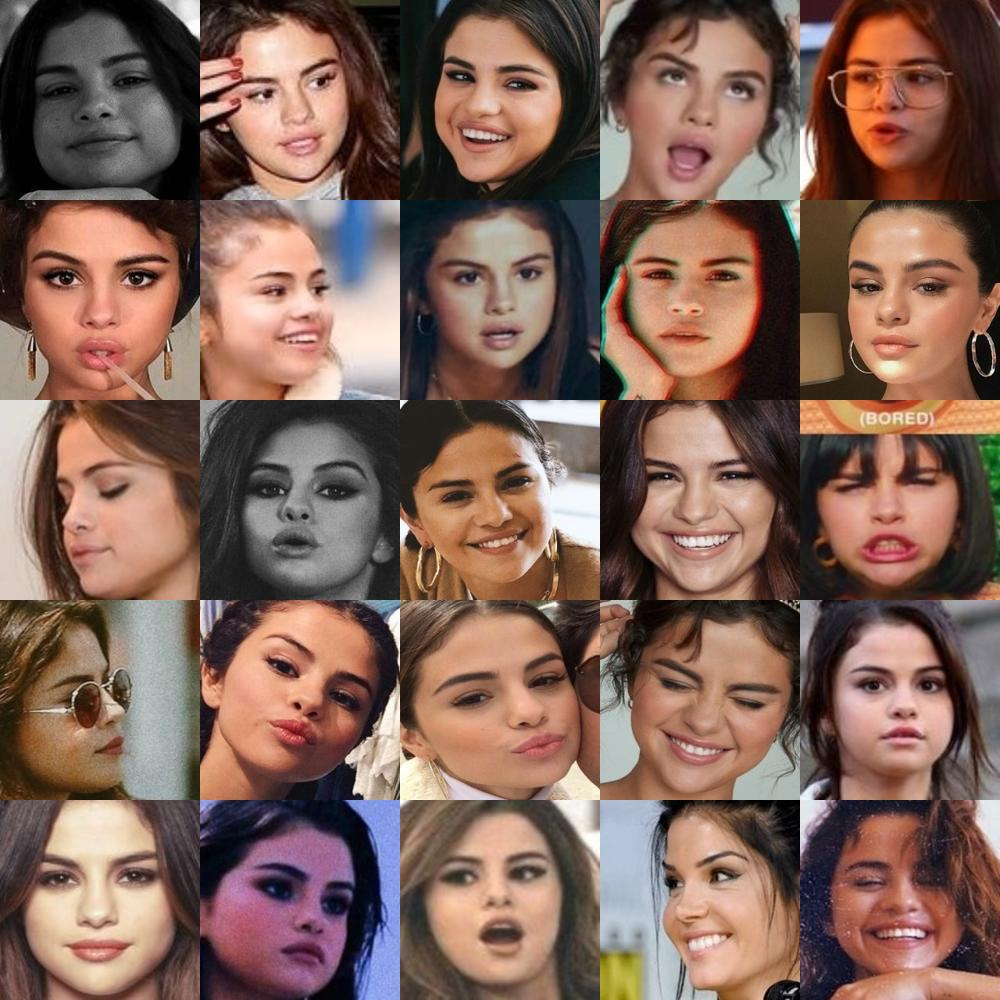
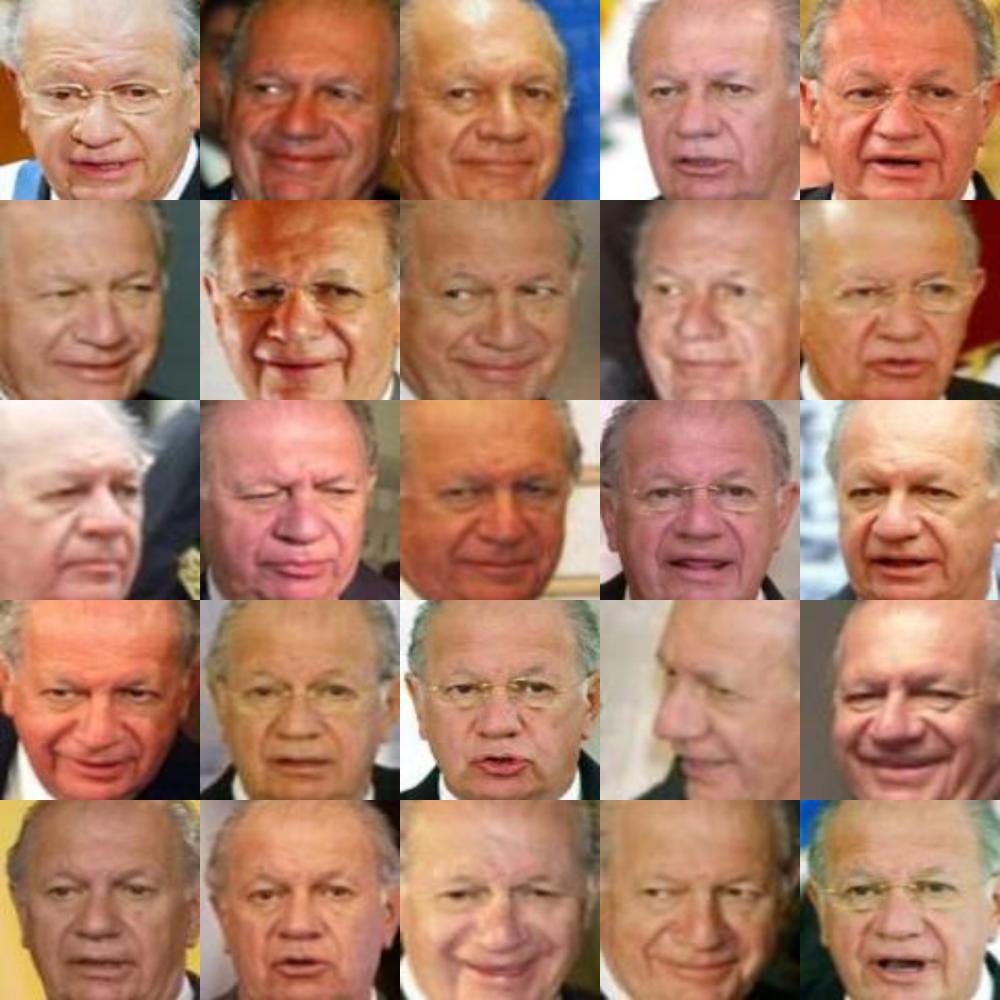
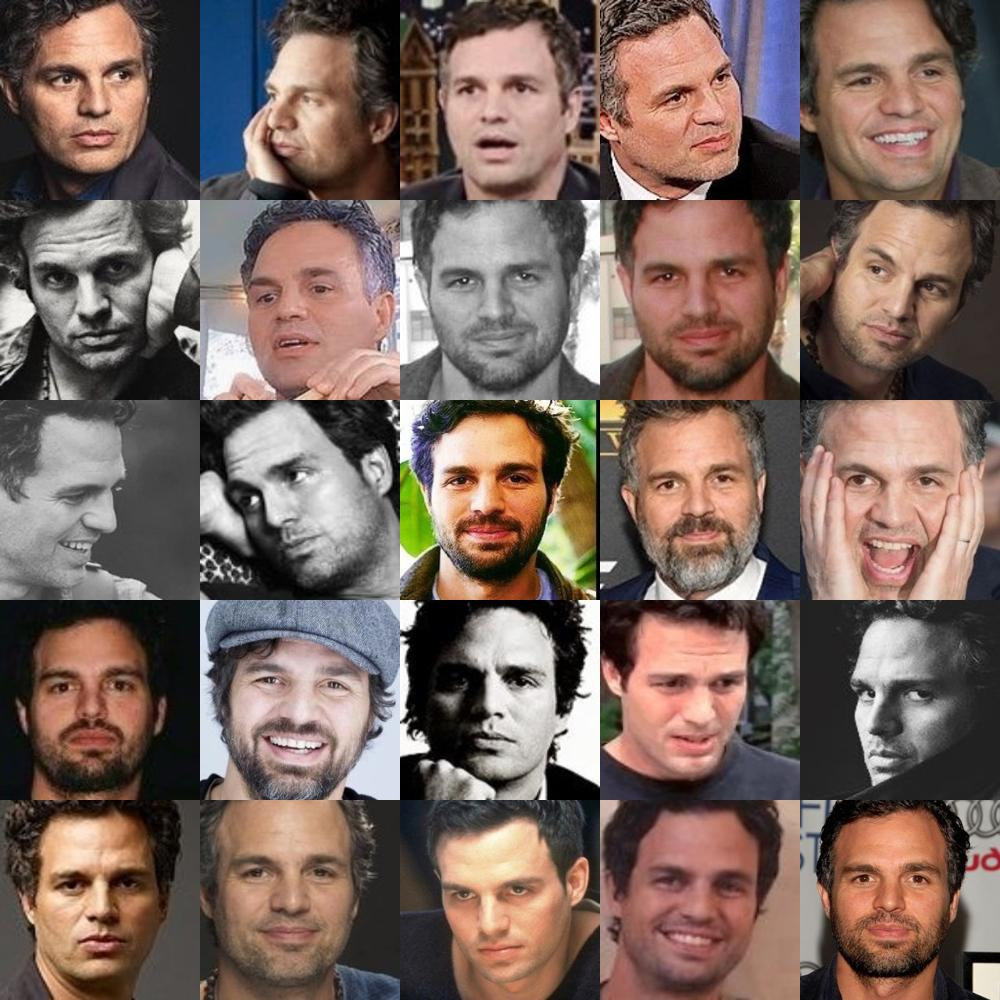
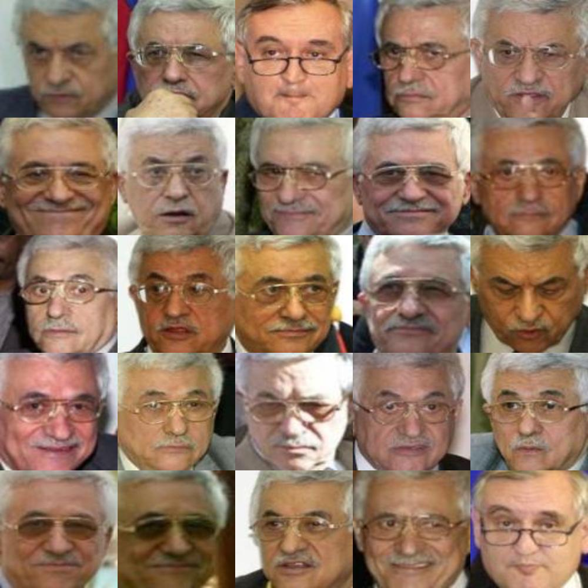
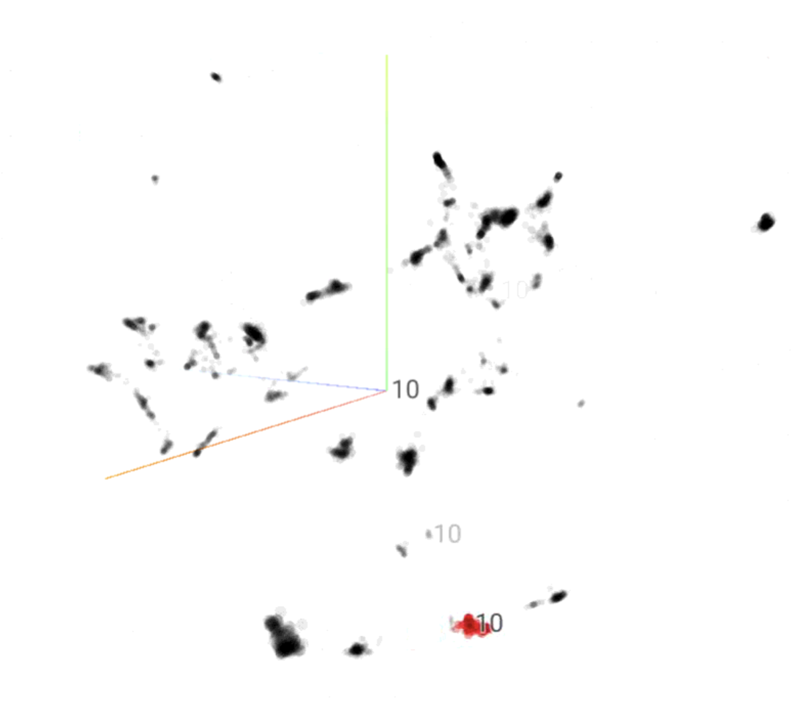
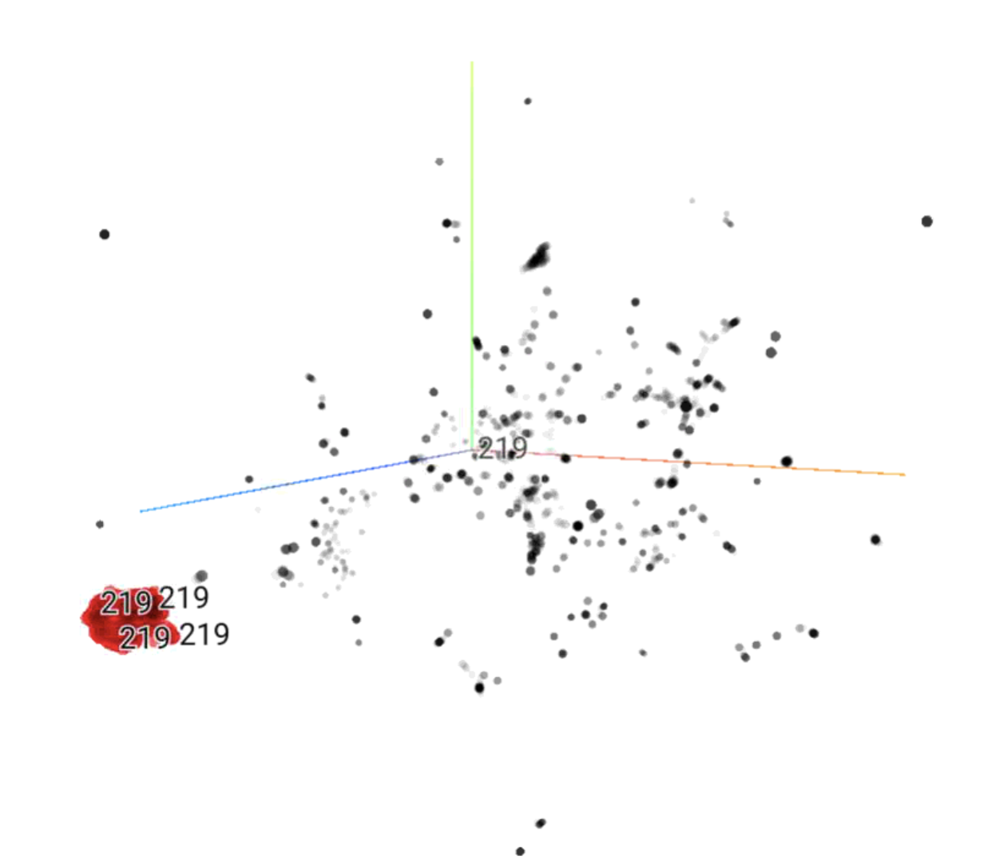
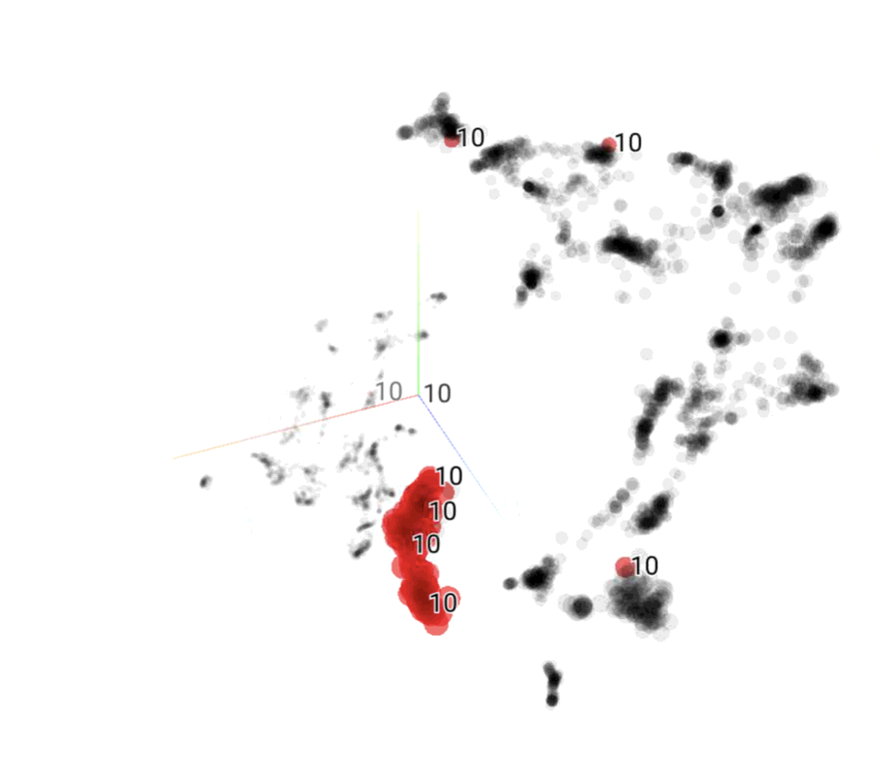
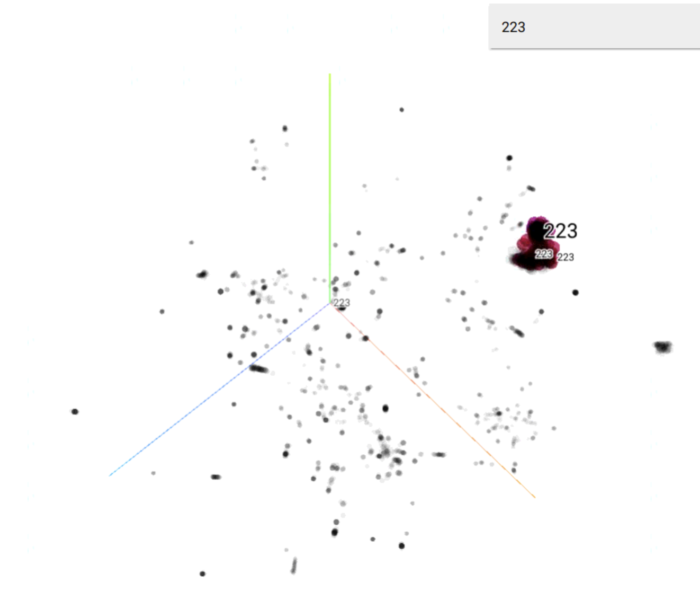

# UnsupervisedFaceClustering

# Evaluation Instruction
```
    pip install -r requirements.txt

    In eval.sh uncomment which version to use.
    3 flags:
        - model_version: which model version to use.
        - dataset_name: this is the name of dataset, default custom. 
        - dataset_folder: path of the folder where all images are there.
        (Note: dataset_folder here is the folder where images are stored inside given classes name)
    output will be stored here: "./evaluation_results/{model_version}/{dataset_name}/"

    If want to test on 105 and LFW, download the data from link and put it inside ./Data/ Folder.
```

### Downloads
- [105_test](https://drive.google.com/file/d/10MCDuLJRA1bZxLvS-5agYbmvPQHEMgZ9/view?usp=sharing)
- [lfw](https://drive.google.com/file/d/1Sz7XBQrfPgjBMc6Nzr9EZYkeEKah5Cwn/view?usp=sharing)
- [evaluation_results](https://drive.google.com/file/d/14DSOAE9Iu2IWla9EjZMpZkAYCzkji1oq/view?usp=sharing)

#### Using Docker:
```
    docker build -t face_clust .
    docker run -v ./evaluation_results/:/app/evaluation_results/ face_clust
```

# Dataset
| Dataset Index | Dataset | Number of Identities | Total Number of Images |
| - | - | - | - |
| 1. | 105_classes_pins_dataset_train | 59 | 9,848 |
| 2. | 105_classes_pins_dataset_test | 46 | 7,686 |
| 3. | CASIA | 10,575 | 452,627 |
| 4. | CELEBA | 10,177 | 201,172 |
| 5. | DigiFace | 10,000 | 720000 |
| 6. | LFW | 311 | 5425 |


# Model Training
| Backbone | Precision | Training Dataset | Evaluation Metrics | Model Path | Model Size | Model FPS |
|-|-|-|-|-|-|-|
| MobileFaceNet| FP32 | 105_train + CELEBA + DigiFace + CASIA | <table><tr><th>Dataset</th><th>NMI</th><th>ARI</th><th>Pairwise F1</th></tr><tr><td>105_test</td><td>0.907</td><td>0.856</td><td>0.862</td></tr><tr><td>lfw</td><td>0.965</td><td>0.955</td><td>0.956</td></tr></table> | | 4.2 mb | 124 |
| MobileFaceNet| FP16 | 105_train + CELEBA + DigiFace + CASIA | <table><tr><th>Dataset</th><th>NMI</th><th>ARI</th><th>Pairwise F1</th></tr><tr><td>105_test</td><td>0.917</td><td>0.867</td><td>0.873</td></tr><tr><td>lfw</td><td>0.965</td><td>0.955</td><td>0.956</td></tr></table> | | 2.2 mb | 1000 |
| MobileFaceNet| PTQ(INT8) | 105_train + CELEBA + DigiFace + CASIA | <table><tr><th>Dataset</th><th>NMI</th><th>ARI</th><th>Pairwise F1</th></tr><tr><td>105_test</td><td>0.910</td><td>0.860</td><td>0.865</td></tr><tr><td>lfw</td><td>0.967</td><td>0.955</td><td>0.956</td></tr></table> | | 1.6 mb | 1300 |
| MobileFaceNetv2 | FP32 | 105_train + CELEBA + DigiFace + CASIA | <table><tr><th>Dataset</th><th>NMI</th><th>ARI</th><th>Pairwise F1</th></tr><tr><td>105_test</td><td>0.876</td><td>0.809</td><td>0.815</td></tr><tr><td>lfw</td><td>0.961</td><td>0.949</td><td>0.951</td></tr></table> | | 4.8 mb | 105 |
| MobileFaceNetv2 | FP16 | 105_train + CELEBA + DigiFace + CASIA | <table><tr><th>Dataset</th><th>NMI</th><th>ARI</th><th>Pairwise F1</th></tr><tr><td>105_test</td><td>0.879</td><td>0.817</td><td>0.822</td></tr><tr><td>lfw</td><td>0.96</td><td>0.948</td><td>0.95</td></tr></table> | | 2.6 mb | 938 |
| MobileFaceNetv2 | PTQ(INT8) | 105_train + CELEBA + DigiFace + CASIA | <table><tr><th>Dataset</th><th>NMI</th><th>ARI</th><th>Pairwise F1</th></tr><tr><td>105_test</td><td>0.802</td><td>0.869</td><td>0.795</td></tr><tr><td>lfw</td><td>0.96</td><td>0.946</td><td>0.947</td></tr></table> | | 2 mb | 1133 |

## Sample Results
<table>
  <tr>
    <th>Model</th>
    <th>105_Classes(Kaggle)</th>
    <th>LFW</th>
  </tr>
  <tr>
    <td>MobileFaceNet</td>
    <td> </td>
    <td> </td>
  </tr>
  <tr>
    <td>MobileFaceNetv2</td>
    <td> </td>
    <td> </td>
  </tr>
</table>

## Umap Visualization
<table>
  <tr>
    <th>Model</th>
    <th>105_Classes(Kaggle)</th>
    <th>LFW</th>
  </tr>
  <tr>
    <td>MobileFaceNet</td>
    <td> </td>
    <td> </td>
  </tr>
  <tr>
    <td>MobileFaceNetv2</td>
    <td> </td>
    <td> </td>
  </tr>
</table>


<!-- 
# ReID Training
- https://github.com/layumi/Person_reID_baseline_pytorch

# Face Clustering
- https://github.com/makarandtapaswi/BallClustering_ICCV2019

- https://arxiv.org/pdf/1705.10444.pdf
- https://github.com/openvinotoolkit/deep-object-reid
- https://github.com/openvinotoolkit/deep-object-reid
- https://github.com/layumi/Person_reID_baseline_pytorch/blob/master/prepare.py
- https://github.com/wangguanan/light-reid

https://arxiv.org/pdf/1908.03381.pdf -->
